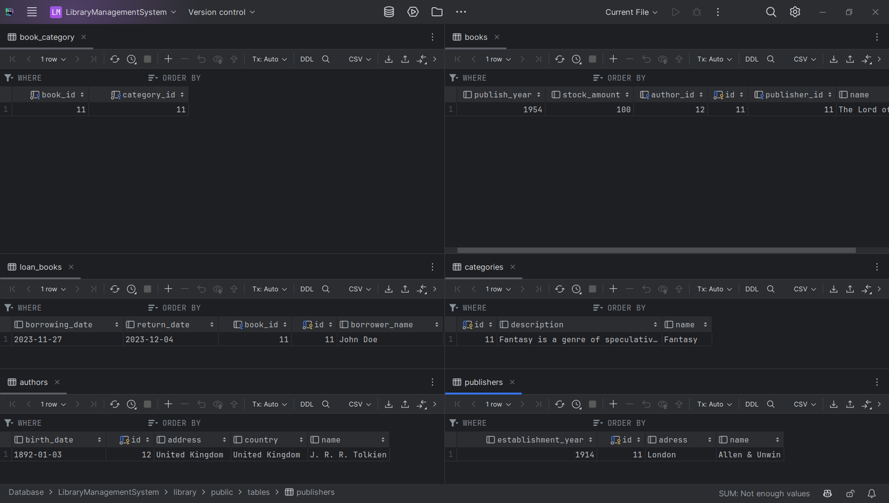
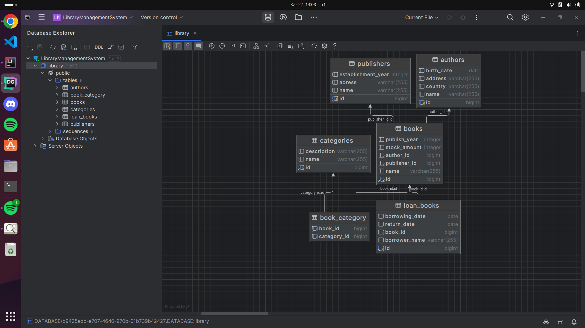

# Library Management System

This project is a library management system implemented in Java using the Maven build tool. The system manages various entities such as books, authors, categories, publishers, and book borrowings.

## Entities

The system manages the following entities:

- **Book:** Each book has a unique ID, name, publication year, and stock amount.
- **Author:** Each author has a unique ID, name, birth date, and country.
- **Category:** Each category has a unique ID, name, and description.
- **Publisher:** Each publisher has a unique ID, name, establishment year, and address.
- **Book Borrowing:** Each book borrowing has a unique ID, borrower name, borrowing date, and return date.

## Database Tables

Here is the image of the database tables:

## Diagram

Here is the diagram related to the project:

## Relationships

The entities have the following relationships:

- A book can have one author, and an author can have multiple books (One-to-Many).
- A category can have multiple books, and a book can belong to multiple categories (Many-to-Many).
- A book can have one publisher, and a publisher can have multiple books (One-to-Many).
- A book can have multiple borrowings, but each borrowing can only belong to one book (One-to-Many).

## Conclusion

This project provides a comprehensive system for managing a library's books, authors, categories, publishers, and borrowings. It demonstrates the use of various JPA annotations to map entities to a PostgreSQL database and manage their relationships.