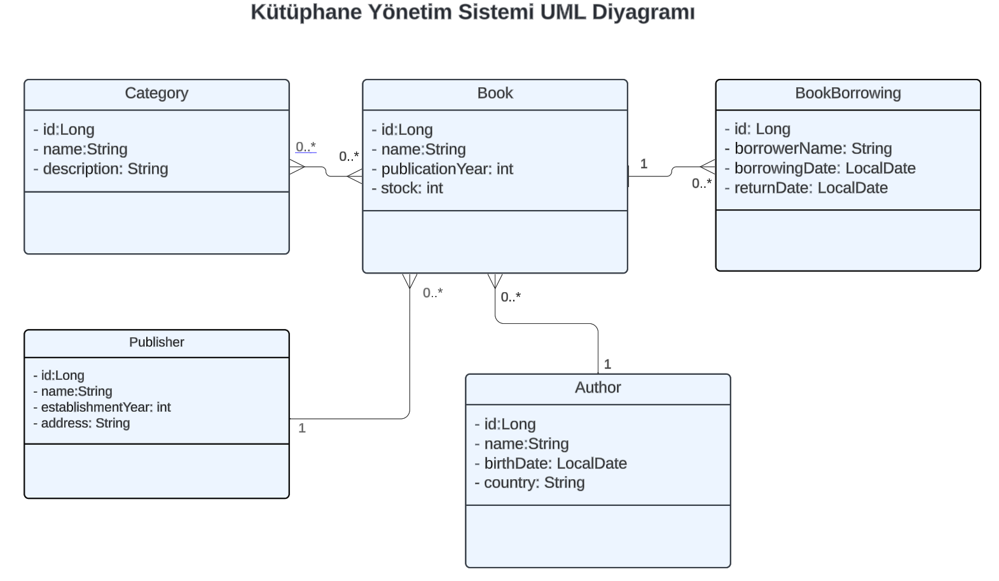

Bir kütüphane yönetim sistemi tasarlamanı istiyoruz. Bu kütüphane sisteminde aşağıdaki entity’ler bulunmaktadır.

## Entity'ler

### Kitap (Book)

- id (Benzersiz kitap kimliği)
- name(Kitap adı)
- publicationYear (Yayın yılı)
- stock (Kütüphanedeki miktarı)

### Yazar (Author)

- id (Benzersiz yazar kimliği)
- name (Yazarın adı)
- birthDate (Yazarın doğum yılı)
- country (Yazarın ülkesi)

### Kategoriler (Category)

- id (Benzersiz kategori kimliği)
- name (Kategori adı)
- description (Kategori tanımı)

### Yayınevi (Publisher)

- id (Benzersiz kimliği)
- name (Yayınevi ismi)
- establishmentYear (Kuruluş yılı)
- address (Yayınevi adresi)

### Kitap Ödünç Alma (BookBorrowing)

- id (Benzersiz kimliği)
- borrowerName (Kitap ödünç alan kişi adı soyadı)
- borrowingDate (Kitap ödünç alma tarihi)
- returnDate (Kitabın teslim edildiği tarih, ilk kayıtta null olacak. Kitap teslim edilince tarih güncellenecek)

## İlişkiler

- Bir kitabın bir yazarı olabilir, bir yazarın birden fazla kitabı olabilir. (One-to-Many ilişkisi).
- Bir kategori birden fazla kitaba sahip olabilirken, bir kitap birden fazla kategoriye ait olabilir. (Many-to-Many ilişkisi).
- Bir kitabın bir yayınevi olabilir, bir yayınevinin birden fazla kitabı olabilir. (One-to-Many ilişkisi).
- Bir kitap birden fazla ödünç alma işlemine sahip olabilir, ancak her ödünç alma işlemi yalnızca bir kitaba ait olabilir. (One-to-Many ilişkisi).

## Ödev

1. Maven java projesi açıp dependency’leri tanımlayın.
2. Yukarıda belirtilen entity (varlık) sınıflarını ve bunların arasındaki ilişkileri kodunuza yazın.
3. Gerekli anotasyonları (@Entity, @Table, @Id, @OneToMany, @ManyToOne, @ManyToMany) yazın.
4. Gerekli Fetch ve Cascade anotasyonlarını yazın.
5. Entity'lerde temel değişkenler belirtilmiş olup entity'ler arası ilişkilere göre sizler değişken eklemelisiniz.
6. Veri tabanı olarak PostgreSQL kullanın.
7. Readme dosyasına veri tabanında oluşan her tablonun ekran görüntüsünü ekleyin.

Başarılar.